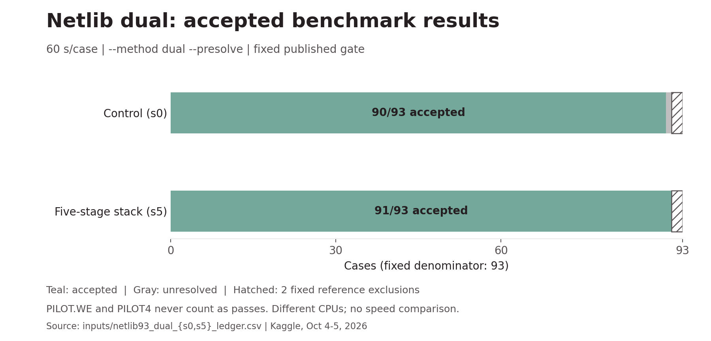
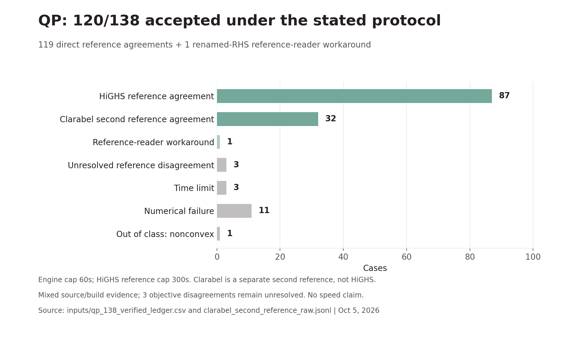
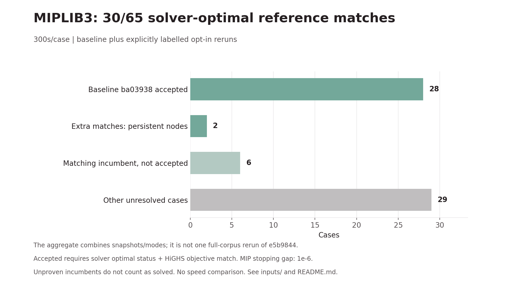
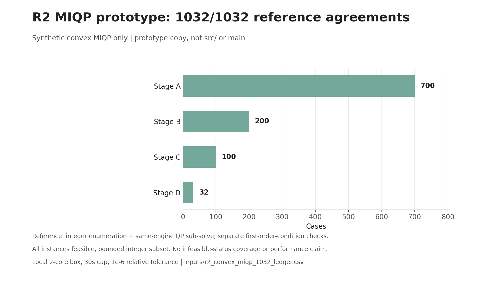

# Benchmark charts, October 5, 2026

These charts are derived from the pinned ledgers in `inputs/`. They are measurements of the named snapshots, not claims about the latest main source. Different sets, reference rules, CPUs and caps must not be pooled into one score. No speed comparison is made.

## Netlib dual, 93 cases



Published fixed gate: s0 90/93, s5 91/93. PILOT.WE and PILOT4 remain in denominator 93 but never count as passes under the fixed reference-exclusion rule, even though their raw CSV rows say pass. PILOT.JA is capped at 60s.

- s0: pristine 692dac0d2efc2fa4db5ccdadb3baba01e85c207e, src tree 5ea2d36d5a2fdd6742388c742b5f9f1a31971cd8, notebook0bb4ac385a, Intel Xeon 2.20GHz.
- s5: five stages (parity, grid, ej, compact nodes, persistent nodes), src tree b33a90782b9068e76df770eb3f88adbe07ef8753, notebooka70e789986, AMD EPYC 7B12. Tree identity binds the result, not an inferred commit ancestry.
- Kaggle CPU, 4 vCPU/31GB; g++ 13.3.0 Ubuntu 24.04, -O2 -ffp-contract=off per run report; --method dual --presolve, 60s engine cap, pinned corpus, gate_pub.py vs HiGHS. Outputs pulled Oct 5 00:17 (s5), 00:18 (s0) IST. Different CPUs preclude speed comparisons.

## QP, 138 cases



120/138 accepted under the reported reference protocol: 87 HiGHS agreements, 32 Clarabel second-reference agreements and one renamed-RHS workaround for a reference-reader artifact. The remaining classes are 3 unresolved disagreements (QBORE3D, QSHARE1B, UBH1), 3 time limits, 11 numerical failures and 1 nonconvex out-of-class model. The 3 disagreements are unresolved, not asserted correct or wrong. Clarabel rows are not HiGHS-verified rows.

99-set: s0 notebook67f4727dc9 and s5 notebook7057f09592, identical outcomes, CSV engine columns from s5. Additional 39-set: s5 notebooks 620559292b, f8649ebe7b, efa7581c31. Source trees as above. Kaggle CPU 4 vCPU/31GB, Xeon or EPYC; g++ 13.3.0 -std=c++17 -O3 -march=native -ffp-contract=off, engine 60s, HiGHS 300s; QP-Test-Problems source 871cc300. Outputs pulled Oct 5 01:36, 08:48, 10:05 IST. Clarabel raw runs use an independent MPS parser and local base 080b4bf engine at -O2. This is mixed source/build evidence, not one all-138 s5 replay.

## MIPLIB3, 65 cases



30/65 solver-optimal results matching HiGHS: 28 on baseline ba03938 plus cap6000 and nw04 on e5b9844 with --persistent-nodes. 6 other incumbents match the reference value but are unproven and do not count: qiu, vpm1, bell5, air04, 10teams, stein45. 29 other cases remain unresolved. HiGHS reports optimal on 54/65 under the same 300s cap. An optimal status uses the declared relative MIP stopping gap 1e-6, not an exact-arithmetic proof: cap6000 has final gap 9.975e-7.

The aggregate combines source snapshots/modes and is not a full-corpus rerun of e5b9844. The compact-node 10-case rerun converted none; the persistent-node 27-timeout rerun converted none. Both are retained in inputs. Baseline Kaggle Xeon 2.20GHz; flag reruns private Kaggle notebooks, same 300s cap and reused original HiGHS reference. Final timeout rerun notebook5c3c00e7dd completed October 5 before 11:55 IST.

## R2 convex MIQP prototype, 1032 synthetic cases



This is **MIQP, not MILP**, and only a prototype copy based on ba03938 with convex-MIQP branch-and-bound and a best-bound fix. It is not in src/ or main and does not establish main's MIQP capability. Ledger reports 1032/1032 reference agreements and first-order-condition flags, all feasible. Strictly convex quadratic objectives, linear inequalities and bounded integer subsets; seeds 26000+119+seed, stages A 0-699, B 1000-1199, C 2000-2099, D 3000-3031. Local 2-core box, 30s cap, regenerated October 5 11:33 IST, objective match tolerance 1e-6 relative. No performance or infeasible-status claim.

Reference scripts in `prototype_reference/` enumerate integer assignments, use the same prototype's continuous QP sub-solver, and check a first-order linearization gap with SciPy/HiGHS. They silently skip non-optimal continuous subproblems without failing the aggregate reference flag and do not separately test point feasibility in `kkt_ok`. Therefore this is reported reference agreement, not a complete independent global-optimality proof. The prototype executable/source drop is not included; main alone cannot reproduce this solver experiment. Archived scripts require `./taral` from that prototype. The chart itself is reproducible from the saved ledger.

## Rebuild the charts

From the repository root, install matplotlib, then:

```sh
python3 benchmarks/plotting/benchmark_charts.py
```

PNG and SVG charts plus `chart_data.json` are regenerated. `chart_data.json` records exact input SHA256 values. No solver or reference run is executed by chart generation. Ledger inputs are preserved byte-for-byte.
